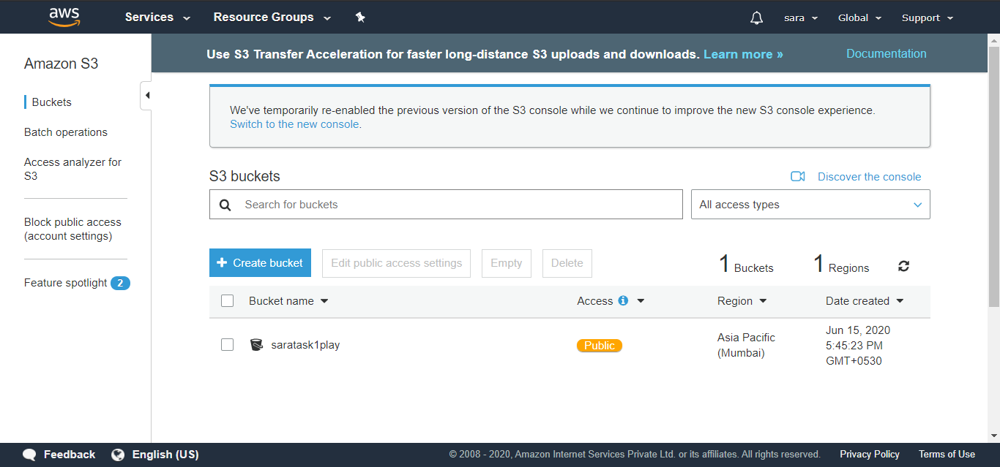

# Task1terraform
# Problem Statement

## Have to create/launch Application using Terraform

1. Create the key and security group which allow the port 80.

2. Launch EC2 instance.

3. In this Ec2 instance use the key and security group which we have created in step 1.

4. Launch one Volume (EBS) and mount that volume into /var/www/html

5. Developer have uploded the code into github repo also the repo has some images.

6. Copy the github repo code into /var/www/html

7. Create S3 bucket, and copy/deploy the images from github repo into the s3 bucket and change the permission to public readable.

8 Create a Cloudfront using s3 bucket(which contains images) and use the Cloudfront URL to  update in code in /var/www/html

## Solution for this problem is:
 

### Initial steps:

* Create the repository from where developer will push the code.

* Configure the hooks so that whenever the developer commit the code it will automaically puch the code to github.

### Step 1: Creating the key and security group:

* key-pair:

```
resource "tls_private_key" "taskkey" {
 algorithm = "RSA"
 rsa_bits = 4096
}

resource "aws_key_pair" "key" {
 key_name = "task1key"
 public_key = "${tls_private_key.taskkey.public_key_openssh}"
 depends_on = [
    tls_private_key.taskkey
    ]
}

resource "local_file" "key1" {
 content = "${tls_private_key.taskkey.private_key_pem}"
 filename = "task1key.pem"
  depends_on = [
    aws_key_pair.key
   ]
}
```


* security-group:

```
resource "aws_security_group" "new" {
  name        = "task1sg"
 
  ingress {
    description = "TCP"
    from_port   = 80	
    to_port     = 80
    protocol    = "tcp"
    cidr_blocks = ["0.0.0.0/0"]
}

 ingress {
    description = "SSH"
    from_port   = 22	
    to_port     = 22
    protocol    = "tcp"
    cidr_blocks = ["0.0.0.0/0"]

}


 egress {
    from_port   = 0	
    to_port     = 0
    protocol    = "-1"
    cidr_blocks = ["0.0.0.0/0"]

}  
  tags = {
    Name = "task1sg"
  }
}
```


### Step 2 and 3: Launcing the EC2 with the key and security group made in step 1:

```
resource "aws_instance" "web" {
  ami           = "ami-0447a12f28fddb066"
  instance_type = "t2.micro"
  key_name = "task1key"
  security_groups = [ "task1sg" ]
  
  connection {
    type     = "ssh"
    user     = "ec2-user"
    private_key = "${tls_private_key.taskkey.private_key_pem}"
    host     = aws_instance.web.public_ip
  }

  provisioner "remote-exec" {
    inline = [
      "sudo yum install httpd  php git -y",
      "sudo systemctl restart httpd",
      "sudo systemctl enable httpd",
    ]
  }

  tags = {
    Name = "sara16paly"
  }
  depends_on = [
    local_file.key1,
    aws_s3_bucket_object.image,
    aws_security_group.new,
    aws_cloudfront_distribution.s3
]
    
}
```


### Step 4,5 and 6: Launch one volume(EBS) mount it and copy the github code into /var/www/html/:

```
resource "aws_ebs_volume" "esb1" {
  availability_zone = aws_instance.web.availability_zone
  size              = 1 
  tags = {
    Name = "ebs1"
  }
}


resource "aws_volume_attachment" "ebs_att" {
  device_name = "/dev/sdh"
  volume_id   = "${aws_ebs_volume.esb1.id}"
  instance_id = "${aws_instance.web.id}"
  force_detach = true
}

resource "null_resource" "nullremote3"  {

depends_on = [
    aws_volume_attachment.ebs_att,
  ]


  connection {
    type     = "ssh"
    user     = "ec2-user"
    private_key = "${tls_private_key.taskkey.private_key_pem}"
    host     = aws_instance.web.public_ip
  }

provisioner "remote-exec" {
    inline = [
      "sudo mkfs.ext4  /dev/xvdh",
      "sudo mount  /dev/xvdh  /var/www/html",
      "sudo rm -rf /var/www/html/*",
      "sudo git clone https://github.com/sara16play/task1cloud.git /var/www/html/"
    ]
  }
}
```


### Step 7: Create S3 bucket, and copy/deploy the images from github repo into the s3 bucket and change the permission to public readable.

```
resource "aws_s3_bucket" "new" {
  bucket = "saratask1play"
  acl    = "public-read"
  force_destroy = "true"
}

resource "null_resource" "null2"  {
  provisioner "local-exec" {
      command = "git clone https://github.com/sara16play/task1cloud.git code/"
    }
}

resource "aws_s3_bucket_object" "image" {
  bucket = "${aws_s3_bucket.new.id}"
  key    = "sara.jpg"
  source = "code/sara.jpg"
  acl = "public-read"
  depends_on = [
    aws_s3_bucket.new
]
}
```




### Step 8: Create a Cloudfront using s3 bucket(which contains images) and use the Cloudfront URL to update in code in /var/www/html

```
resource "aws_cloudfront_distribution" "s3" {
depends_on = [ aws_s3_bucket_object.image]  
origin {
    domain_name = "${aws_s3_bucket.new.bucket_regional_domain_name}"
    origin_id   = "${aws_s3_bucket.new.id}"
    
    
custom_origin_config {
            http_port = 80
            https_port = 80
            origin_protocol_policy = "match-viewer"
            origin_ssl_protocols = ["TLSv1", "TLSv1.1", "TLSv1.2"]
     }
}

  enabled             = true
  is_ipv6_enabled     = true
  comment             = "hello"

  default_cache_behavior {
    allowed_methods  = ["DELETE", "GET", "HEAD", "OPTIONS", "PATCH", "POST", "PUT"]
    cached_methods   = ["GET", "HEAD"]
    target_origin_id = "${aws_s3_bucket.new.id}"

    forwarded_values {
      query_string = false

      cookies {
        forward = "none"
      }
    }

    viewer_protocol_policy = "allow-all"
    min_ttl                = 0
    default_ttl            = 3600
    max_ttl                = 86400
  }

restrictions {
    geo_restriction {
      restriction_type = "whitelist"
      locations        = ["US", "CA", "GB", "DE", "IN"]
    }
  }

  viewer_certificate {
    cloudfront_default_certificate = true
  }
}

resource "null_resource" "nullRemote40" {
   depends_on = [aws_cloudfront_distribution.s3,
                 aws_instance.web,
                 null_resource.nullremote3]
	connection {
    type     = "ssh"
    user     = "ec2-user"
    private_key = "${tls_private_key.taskkey.private_key_pem}"
    host     = aws_instance.web.public_ip
    	}


	provisioner "remote-exec" {
		inline = [
			"sudo sed -i 's@path@https://${aws_cloudfront_distribution.s3.domain_name}/${aws_s3_bucket_object.image.key}@g' /var/www/html/index.html"
		]
	}
}

```


* You can see the src in image tag is using the cloudfront url

### Extra:

* To run the aws instance directly from terraform:

```
resource "null_resource" "nulllocal1"  {


depends_on = [
    null_resource.nullremote3,
     aws_instance.web
  ]

	provisioner "local-exec" {
	    command = "chrome  ${aws_instance.web.public_ip}"
  	}

}
```


* In this the image is coming from the cloudfront url.

* To delete the github files once they have copied to the s3:

```
resource "null_resource" "nulllocal10"  {


depends_on = [
    null_resource.nullremote3,
     aws_instance.web
  ]

provisioner "local-exec"{
 command  =   "rd /s /q code"
}

}
```

## After putting these code in onc file of .tf extension run this file

* For this you have to install the terraform

* Then ```aws configure```

* Then, ```terraform inti```

* Then, ```terraform plan or terraform ```

* Finally run the file ```terraform apply -auto-approve```

* If want to destroy the environment ```terraform destroy -auto-approve```
## Some more SS for reference:


## Built With

* Terraform
* AWS
* Git & GitHub

## Author

[SAURAV PATEL](https://www.linkedin.com/in/saurav-patel-148539151/)
